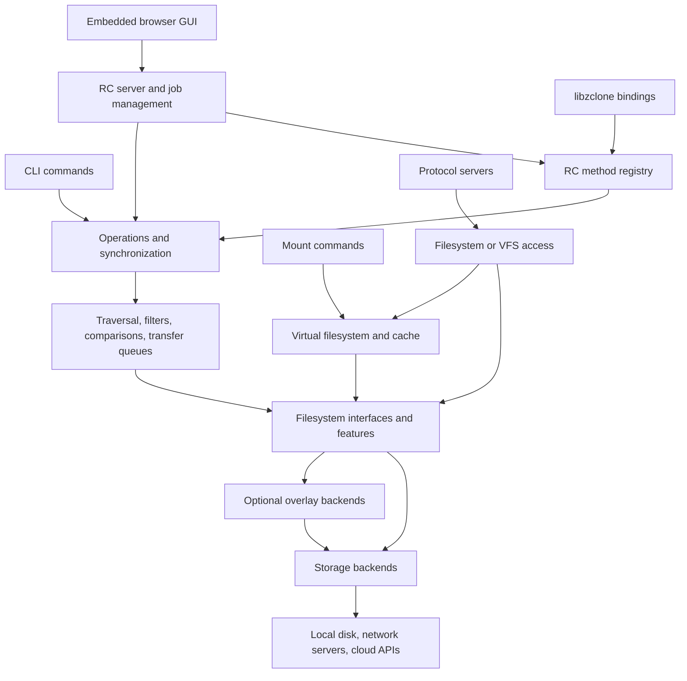

# Zclone

[](https://github.com/zipkindev/zClone/actions/workflows/ci.yml)
[](https://github.com/zipkindev/zClone/actions/workflows/codeql.yml)
[](COPYING)
[](toolchain/README.md)

Zclone is a local-first file-transfer and synchronization application written in
Go. It provides one command-line interface for local disks, network filesystems,
cloud drives, and object stores, with concurrent transfers, filtering, retries,
and verification. An embedded browser interface, a remote-control API, filesystem
mounts, and protocol servers expose the same storage engine in other workflows.

> [!IMPORTANT]
> Zclone is an independently maintained derivative of
> [rclone](https://github.com/rclone/rclone). Most of this code and its Git history
> were created by Nick Craig-Wood and the rclone contributors. Zclone is not
> affiliated with or endorsed by the rclone project. See [FORK.md](FORK.md) for
> the fork point, project relationship, and upstream synchronization guidance.

## Why this project exists

Zclone packages the rclone storage engine for environments where builds and
deployment must remain locally controlled. It began as a practical adaptation
for a restricted work laptop and evolved into a reproducible downstream
distribution with reviewed vendored dependencies, offline Go module resolution,
source-integrity verification, an embedded local control interface, and explicit
release boundaries.

The downstream engineering work is intentionally distinguishable from upstream:

- **Reproducible offline builds:** normal builds use the committed `vendor/`
  tree with `GOPROXY=off`, `GOSUMDB=off`, and `GOFLAGS=-mod=vendor`.
- **Supply-chain evidence:** a reviewed dependency checksum manifest, CycloneDX
  SBOM generation, embedded-asset verification, and immutable CI action pins.
- **Restricted-system defaults:** self-update and implicit release endpoints are
  disabled, and external GUI assets are replaced by a small embedded interface.
- **Local distribution tooling:** deterministic application naming, local
  verification scripts, macOS packaging, and explicit signing hooks.
- **Automated assurance:** Linux verification and compatibility regression tests,
  cross-platform compilation on Linux/macOS/Windows, and CodeQL analysis through
  GitHub Actions.

This repository is best understood as downstream productization and maintenance
of a mature open-source codebase—not a claim of authorship over rclone itself.

Zclone runs on the machine where you launch it. Ordinary copy and sync commands
run to completion; a persistent service is only needed for workflows such as
mounting, serving files, or accepting API calls. Remote-to-remote transfers normally
pass through that machine unless compatible backends support server-side copying.

Zclone is not an implementation of rsync's block-delta protocol. It generally
transfers changed files rather than only their changed blocks. For large,
partially modified files on a host that runs rsync, rsync can be faster.

## Contents

- [Why this project exists](#why-this-project-exists)
- [Getting started](#getting-started)
- [How transfers work](#how-transfers-work)
- [Features and commands](#features-and-commands)
- [Browser interface and automation](#browser-interface-and-automation)
- [Architectural design](#architectural-design)
- [Build, installation, and verification](#build-installation-and-verification)
- [Repository guide](#repository-guide)
- [Contributing and attribution](#contributing-and-attribution)
- [Security](#security)

## Getting started

The verified local build uses Go 1.27.0 and the committed `vendor/` dependency
tree. Install the toolchain before building; the standard build does not download
Go modules. See [the toolchain profile](toolchain/README.md) for details.

```console
make zclone
./build/zclone version
./build/zclone help
```

The examples below use `./build/zclone` directly. After installation, the same
commands can be run as `zclone`.

### Configure a storage connection

A **remote** is a named storage configuration, such as an SFTP connection or a
cloud account. Create one interactively and inspect its directories:

```console
./build/zclone config
./build/zclone listremotes
./build/zclone lsd remote:
./build/zclone config file
```

Replace `remote` with the name you created. A path such as `remote:archive/photos`
is relative to that remote's root; `./photos` is a local path. Object-store paths
usually include a bucket or container, for example `remote:bucket/photos`.
Backend-specific setup determines authentication and the meaning of the root.

Configuration is managed by `fs/config`; `--config` or `ZCLONE_CONFIG` can select
an explicit file. Backend options can also be supplied through supported flags
and environment variables. Use `help backend <type>` to inspect a backend's
options and `help flags` to inspect global controls.

### Copy, preview a mirror, and verify

```console
./build/zclone copy ./source remote:archive/source --transfers 4 --checkers 8 --progress
./build/zclone sync ./source remote:mirror/source --dry-run
./build/zclone check ./source remote:archive/source --one-way --download
```

`copy` copies the source directory's contents, skips files considered unchanged,
and retains destination-only files. It can overwrite changed files at matching
paths, so an additive copy is not an immutable backup.

`sync` makes the destination match the source within the selected scope, including
removing destination-only files. Review the dry run before removing `--dry-run`.
`check --one-way` verifies the source files without treating additional destination
files as errors. `--download` compares file contents when a common backend hash
is unavailable, at the cost of reading the data.

## How transfers work

A typical directory copy or sync moves through these stages:

1. **Resolve configuration and paths.** The command parses arguments and options,
   loads the named remotes, and creates source and destination filesystem objects.
2. **Discover entries.** The directory walker lists both sides and applies filters
   for names, paths, sizes, ages, or explicit file lists.
3. **Compare files.** Checker workers determine what needs transferring. The usual
   comparison uses size and modification time; `--checksum` requests size and a
   common hash where available, falling back to size when no common hash exists.
4. **Queue and transfer.** Transfer workers process changed or missing objects.
   Compatible backends may copy or move objects server-side; otherwise Zclone
   reads from the source and writes to the destination through the local process.
5. **Handle failures and account for work.** Request pacing and low-level retries
   handle transient backend errors, while command-level retries can repeat work.
   Accounting tracks bytes, rates, checks, transfers, and errors.
6. **Apply command semantics and finish.** Copy retains extra destination files;
   sync applies its deletion policy; move removes successfully moved source files.
   The command reports its result and exits with a status usable by scripts.

`--transfers` bounds concurrent file transfers, `--checkers` controls comparison
workers, and `--max-backlog` controls queued work. Some modes, such as
`--check-first`, accumulate work before transferring and have different memory
requirements. A backend may also use multiple streams or multipart upload within
one transfer, so transfer count alone is not a connection or memory limit.

Transfers are not a transaction spanning an entire directory tree. Successful
files can remain in place when another file fails. Re-running a command normally
compares the endpoints again and skips completed files that match. Metadata,
checksums, timestamp precision, empty directories, and atomic operations depend
on each backend's capabilities.

## Features and commands

### Storage backends

The [backend registry](backend/all/all.go) imports the available storage adapters.
They include:

| Category | Examples |
| --- | --- |
| Local and network storage | Local filesystem, SFTP, SMB/CIFS, FTP, WebDAV, HTTP, HDFS |
| Object storage | S3-compatible services, Azure Blob, Google Cloud Storage, Backblaze B2, Swift, Oracle Object Storage, Storj |
| Cloud drives and file services | Google Drive, OneDrive, Dropbox, Box, iCloud Drive, Proton Drive, Filen, MEGA, pCloud |
| Composable storage layers | Crypt, compress, archive, chunker, union, combine, alias, hasher, cache |
| In-memory storage | Memory backend for temporary data and tests |

Overlay backends add behavior to other remotes. For example, `crypt` encrypts file
contents and can encrypt names, `chunker` splits large files into smaller objects,
`union` combines storage under a policy, and `alias` exposes another path under a
new name. These layers have their own configuration and compatibility constraints.
Encryption at rest requires configuring the appropriate layer or provider feature;
it is not automatically applied to every remote.

### File management and synchronization

| Workflow | Commands and behavior |
| --- | --- |
| Copy | `copy` for directory contents, `copyto` for an exact destination path, `copyurl` for a URL source |
| Mirror | `sync` updates the destination from the source and can delete destination-only files |
| Move | `move` and `moveto` transfer data and remove the successfully moved source files |
| Bidirectional sync | `bisync` tracks both sides across runs and propagates changes in both directions |
| Browse | `ls`, `lsl`, `lsd`, `lsf`, `lsjson`, `tree`, and interactive `ncdu` |
| Inspect | `size`, `about`, `hashsum`, `md5sum`, and `sha1sum`, subject to backend support |
| Verify | `check`, `checksum`, and `cryptcheck` for their respective comparison workflows |
| Stream | `cat` reads to standard output; `rcat` uploads from standard input |
| Maintain | `mkdir`, `rmdir`, `rmdirs`, `touch`, `delete`, `deletefile`, and `purge` |
| Specialized operations | `dedupe`, `cleanup`, `settier`, `link`, `backend`, and archive creation, listing, and extraction |

`bisync` maintains listing state between runs and has initialization, conflict,
and recovery rules; read [the bisync guide](docs/content/bisync.md) before using
it on important data. `purge` removes an entire path and its contents, including
files that filters would otherwise exclude. Specialized operations are available
only where the backend supports them.

### Transfer controls and observability

- **Selection:** `--include`, `--exclude`, `--filter`, and `--files-from` select
  data; size and age limits further constrain work.
- **Comparison:** `--checksum`, `--size-only`, and `--ignore-times` change how
  existing files are evaluated. Choose based on the endpoint's metadata support.
- **Throughput:** `--transfers`, `--checkers`, `--bwlimit`, and `--tpslimit` control
  concurrency, bandwidth, and request rate. Backend-specific flags tune uploads
  and connections.
- **Retry policy:** `--retries`, `--low-level-retries`, and `--retries-sleep`
  control repeated attempts at the command and request levels.
- **Change controls:** `--dry-run`, `--interactive`, `--max-delete`, and
  `--backup-dir` help preview, constrain, or retain data affected by operations
  that support them.
- **Reporting:** `--progress`, `--stats`, verbosity flags, `--log-file`, and
  `--use-json-log` support terminal monitoring and log processing. RC servers can
  optionally expose OpenMetrics/Prometheus metrics.

See [filtering](docs/content/filtering.md), [usage](docs/content/docs.md), and
individual command help for detailed interactions and defaults.

### Mounts and protocol servers

`mount`, `mount2`, `cmount`, and `nfsmount` provide platform-dependent ways to
access a remote through a filesystem path. The virtual filesystem layer supplies
file handles, directory caching, and optional disk caching to bridge application
filesystem access and backend object operations. VFS cache settings affect
compatibility, local disk use, and when writes reach the remote. Available mount
commands depend on the operating system, build tags, and required drivers.

`serve` exposes storage through protocols including HTTP, WebDAV, SFTP, FTP, NFS,
S3, and the restic REST protocol, with additional DLNA and Docker integrations.
For example, a loopback HTTP file server can be started with:

```console
./build/zclone serve http remote:public --addr 127.0.0.1:8080
```

Mounts and servers stay running while clients use them. Authentication, network
binding, and protocol-specific behavior are configured on the relevant command.

## Browser interface and automation

### Embedded browser interface

```console
./build/zclone gui --user gui --pass 'replace-with-your-password'
```

The GUI command serves embedded assets and starts an RC API server on separate,
automatically selected localhost ports, then opens the browser. The username
defaults to `gui`; a password is required unless authentication is explicitly
disabled with `--no-auth`. Use `--no-open-browser` to open the printed address
manually, and `--addr` / `--api-addr` to choose listening addresses.

The bundled **Zclone Control** page is a small RC request form. It discovers the
API endpoint, accepts credentials and a command such as `core/version`, sends an
empty JSON object, and displays the response. It does not provide a file browser,
a transfer-planning dashboard, or fields for arbitrary JSON parameters. Although
the page suggests read-only calls, it does not enforce a read-only command list;
the selected API method determines the operation.

The assets are plain HTML, CSS, and JavaScript stored in `cmd/gui/dist/` and
embedded from `dist.zip`. The page uses no external assets or telemetry service
and does not place credentials in URLs or persist them in browser storage. The
API's default allowed origin is derived from the GUI listener. An alternate local
directory or ZIP can be supplied as `gui [path]` for interface development.

### Remote-control API

`rcd` runs the API daemon without the GUI, and `rc` invokes API methods:

```console
./build/zclone rcd --rc-addr 127.0.0.1:5572 --rc-user control --rc-pass 'replace-with-your-password'
```

In another terminal:

```console
./build/zclone rc --rc-user control --rc-pass 'replace-with-your-password' core/version
```

The RC layer provides JSON methods for configuration, listing, operations,
synchronization, statistics, and job management. Supported calls can run
asynchronously with `_async=true`, returning a job ID for status checks and
cancellation. See [the RC reference](docs/content/rc.md) for method parameters.
CLI scripts can also use exit codes and `lsjson` without running a daemon.
Scheduling repeated runs is handled by the caller, such as a system scheduler.

For embedding, [libzclone](libzclone/README.md) exposes the RC machinery through
Go and C-compatible entry points, with additional language bindings. These
library interfaces are experimental.

## Architectural design

Zclone uses a shared filesystem abstraction so commands and algorithms can work
across storage providers without implementing each provider's API themselves.



### Startup and registration

[zclone.go](zclone.go) imports the backend and command registries, loads the plugin
package, and calls `cmd.Main()`. Go package initialization registers commands with
Cobra and backends with `fs.Register`. A backend's `fs.RegInfo` describes its name,
configuration options, and `NewFs` constructor. Most adapters are compiled into
the binary through blank imports in `backend/all` and `cmd/all`.

The CLI layer owns argument handling and command execution. It calls shared
packages for storage operations rather than duplicating transfer logic. The RC
method registry provides another entry point to that shared functionality.

### Filesystem contracts and capabilities

[fs/types.go](fs/types.go) defines the main contracts:

| Contract | Responsibility |
| --- | --- |
| `fs.Fs` | List directories, find objects, upload data, and create or remove directories |
| `fs.Info` | Describe a remote's name, root, timestamp precision, hashes, and features |
| `fs.Object` | Read, update, remove, and set the modification time of a file object |
| `fs.DirEntry` | Represent shared file/directory properties such as path, size, and time |
| `fs.Features` | Advertise optional capabilities and operation hooks |

[fs/features.go](fs/features.go) describes differences such as server-side copy,
move, directory operations, metadata, empty directories, and change notification.
Algorithms inspect these capabilities and use generic alternatives where possible.
An unavailable feature may require a fallback or make an operation unsupported.
Provider-specific behavior belongs in the backend; core code must work across
backends, including overlays.

### Transfer engine and shared infrastructure

- **`fs/march`** walks source and destination directory trees and matches entries.
- **`fs/filter`** applies the selected scope to discovery and operations.
- **`fs/sync`** coordinates comparison workers, transfer queues, and deletion
  policies for directory copy, move, and sync.
- **`fs/operations`** implements shared object-level transfers, checks, listings,
  and other file operations; **`cmd/bisync`** adds two-way synchronization state.
- **`fs/accounting`** tracks transfer activity and bandwidth use.
- **`fs/config`** loads and stores configuration; **`fs/cache`** reuses filesystem
  instances; **`fs/fshttp`** provides shared HTTP client configuration.
- **`lib/rest`**, **`lib/oauthutil`**, **`lib/pacer`**, and **`lib/dircache`** supply
  reusable HTTP, authentication, request pacing, and directory-ID caching helpers.
- **`vfs`** adapts object storage to filesystem-style access, with directory and
  file caching; **`fs/rc`** supplies API registration, servers, and jobs.

A backend typically keeps its filesystem and object implementation in one main
Go file, with API types in a separate package when needed. This keeps provider
integration together while sharing traversal, transfer, and VFS logic.

### State and security boundaries

Durable state lives in the selected storage systems and local files such as the
configuration, bisync listings, and enabled caches. The core does not require a
central application database or hosted control service. In-process queues,
accounting, and RC jobs belong to the running process rather than a durable job
scheduler.

Backend credentials and OAuth tokens come from configuration or supported runtime
options. Config-file encryption is available; password obscuring is reversible
and should not be treated as encryption. The repository ignores local credentials
and machine-specific configuration. Copy `.env.example` to `.env` only for local
integration tests and keep the resulting file private.

The GUI/API boundary controls access to powerful local operations, while backend
authentication controls access to storage. Local asset serving and offline builds
do not make cloud operations offline: those still contact the configured service.

## Build, installation, and verification

### Offline build profile

`make zclone` builds `build/zclone` with version information, vendored modules,
trimmed source paths, and automatic VCS stamping disabled. The Makefile sets:

```console
GOPROXY=off GOSUMDB=off GOFLAGS=-mod=vendor
```

Apply those settings to direct Go build or test commands as well. `go.mod`
declares Go 1.26.0, while the project's verification script requires the reviewed
Go 1.27.0 toolchain. Native tools or drivers may be needed for optional build tags,
mounts, C bindings, and packaging. Self-update is disabled in the default build;
release endpoints are supplied explicitly by the release environment.

### macOS installation

```console
make macos-installer
```

The command prints the generated package path, named
`build/Zclone-<VERSION>-<architecture>.pkg`. Install that file, for example:

```console
sudo installer -pkg build/Zclone-v0.1.0-arm64.pkg -target /
```

Use the actual version and architecture printed by the build. The package places
the executable under `/usr/local/lib/zclone`, exposes `zclone` through
`/usr/local/bin`, and adds that directory to new login-shell PATHs through
`/etc/paths.d/zclone`.

Default signing is ad hoc and the package is unsigned unless an installer signing
identity is supplied. `make release-sign` requires an Apple Developer signing
identity; see [the Makefile](Makefile) and
[installer script](installer/macos/build-installer.sh) for packaging options.

### Verification and tests

```console
make verify-local
make quicktest
```

`verify-local` checks the toolchain, builds the executable, compiles package tests,
runs `go vet`, and executes focused tests for the GUI, configuration, operations,
sync, and memory backend. It also generates a CycloneDX SBOM, verifies the vendored
source manifest and embedded GUI archive, and signs/verifies the executable when
`codesign` is available. `quicktest` runs the broader Go test suite with an explicit
nonexistent configuration path.

On restricted runners that cannot bind loopback test servers:

```console
ZCLONE_SKIP_NETWORK_TESTS=1 make verify-local
```

That override skips the focused runtime tests, so it is not equivalent to a full
verification. Release runners should run without it. Provider integration tests
need suitable configured test remotes; local verification alone cannot establish
compatibility with every cloud service.

Additional targets include `make racequicktest`, `make verify-sources`,
`make verify-gui-dist`, and `make sbom`. The SBOM is written to
`build/zclone.sbom.cdx.json`; `DEPENDENCY_MANIFEST.sha256` records reviewed source
checksums. See [self-hosted verification](ci/README.md) and
[contribution testing guidance](CONTRIBUTING.md#testing).

## Repository guide

| Path | Contents |
| --- | --- |
| `zclone.go` | Application entry point |
| `backend/` | Storage adapters and overlay backends |
| `cmd/` | CLI commands, mount/serve integrations, and embedded GUI assets |
| `fs/` | Filesystem contracts, config, operations, synchronization, filters, accounting, and RC |
| `vfs/` | Filesystem access and caching for mounts and compatible servers |
| `lib/` | Shared infrastructure and utility packages |
| `libzclone/` | Embedding API and language bindings |
| `fstest/` | Backend contract tests, integration helpers, and test runners |
| `docs/content/` | Usage, command, backend, and architecture-related documentation |
| `vendor/` and `third_party/` | Dependency source and third-party components |
| `bin/` | Build, verification, documentation, and maintenance tools |
| `toolchain/` and `ci/` | Local toolchain and self-hosted verification guidance |
| `installer/macos/` | macOS installer construction and post-install scripts |
| `build/` | Generated binaries, verification reports, and packages |

Backend option help is maintained in Go option definitions, and command help in
command source. Generated documentation should not be edited as the source of
truth. Use [CONTRIBUTING.md](CONTRIBUTING.md) and [AGENTS.md](AGENTS.md) when
changing or extending the implementation.

## Contributing and attribution

Compatibility across existing commands, flags, APIs, and storage backends is a
core design constraint. Contributions should stay focused, use existing shared
helpers, and include tests that exercise the intended behavior. Backend contract
tests live in `fstest/fstests`; real-provider testing complements local tests.

Zclone is maintained as a distinct downstream project derived from
[rclone](https://github.com/rclone/rclone). The original authors remain credited
in the preserved Git history, and required upstream copyright, license, and
third-party attribution are retained in [COPYING](COPYING), [NOTICE](NOTICE),
and `vendor/`. See [FORK.md](FORK.md) for detailed provenance. The Zclone name
does not imply affiliation with or endorsement by the rclone project.

## Security

Please report suspected vulnerabilities privately as described in
[SECURITY.md](SECURITY.md). Never include live credentials, private file names,
or production endpoint details in an issue, log excerpt, or test fixture.
